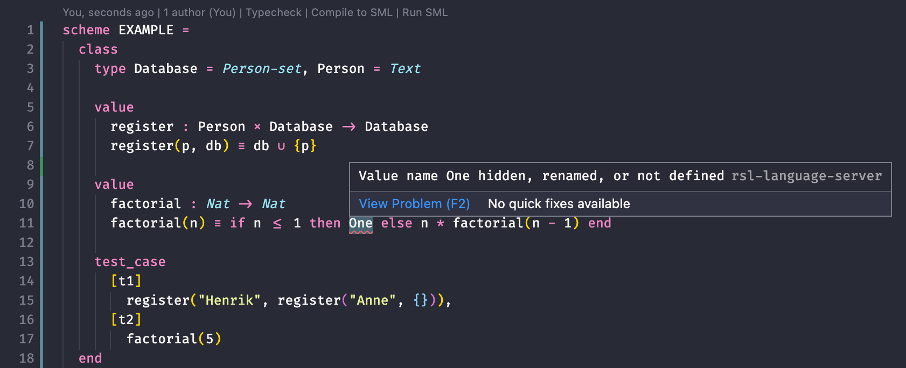

# RSL extension for VS Code

VS Code extension introducing support for the RAISE Specification Language. For a file to be recognized as RSL it has to have the `.rsl` extension.



## Features

- Syntax highlighing
- Commands for type checking, compilation to, and execution of generated SML with extraction of test results
- [Language server](https://github.com/JakuJ/rsl-language-server) integration for on-save diagnostics
- Formatting via the `rsltc` pretty-printer
- Auto-indentation
- Snippets for `scheme` and `class` keywords

## Requirements

Install this extension from the Extension menu in VS Code and make sure you also have the following dependencies:

### RSL Tools

This extension requires the `rsltc` and `sml` binaries to be globally available (put them in your `PATH`).

#### Optional: Docker utility script

If you cannot run `rsltc` or `sml` on your OS natively (as is the case with macOS), you might want to use the [Docker utility script](https://github.com/JakuJ/raise-docker-util).

### Language server

Install the [rsl-language-server](https://github.com/JakuJ/rsl-language-server) and add it to your `PATH` or define the path to it in the configuration.

## Configuration

The following configuration options are grouped under the "RAISE" category:

| Key                                      | Default value       | Description                                |
| ---------------------------------------- | ------------------- | ------------------------------------------ |
| raise.commands.typecheck                 | rsltc               | Command used to run type checking          |
| raise.commands.compile                   | rsltc -m            | Command used to generate SML               |
| raise.commands.execute                   | sml <               | Command used to run SML                    |
| raise.commands.format                    | rsltc -pl 80        | Command used to pretty-print               |
| raise.format.enable                      | true                | Whether to enable code formatting          |
| raise.languageServer.path                | rsl-language-server | Path to the RSL LS executable              |
| raise.languageServer.compilerDiagnostics | true                | Whether to report SML compiler diagnostics |

> [!WARN]
> If format-on-save (`editor.formatOnSave` setting) is enabled, the RSL formatter might overwrite files with old content, effectively preventing any changes to the document. If this is the case for you, either disable format-on-save or uncheck `raise.format.enable` to remove RSL formatting altogether.

### macOS

`rsltc` versions 2.5 and 2.6 are known to segfault on MacOS for some flags (e.g. `-c` or `-pl <length>`). `sml` is also completely broken because of the 64-bit architecture of macOS. Therefore, some functions like pretty-printing need to be executed inside a 32-bit Linux container.

To achieve full functionality of the extension on macOS, the following commands must be changed in the configuration. Using [raise.sh](https://github.com/JakuJ/raise-docker-util) is one way to do it:

```json
{
  "raise.commands.execute": "raise.sh sml",
  "raise.commands.format": "raise.sh rsltc -pl 80",
}
```

# Development

```shell
$ npm install
$ npx @vscode/vsce package
```
